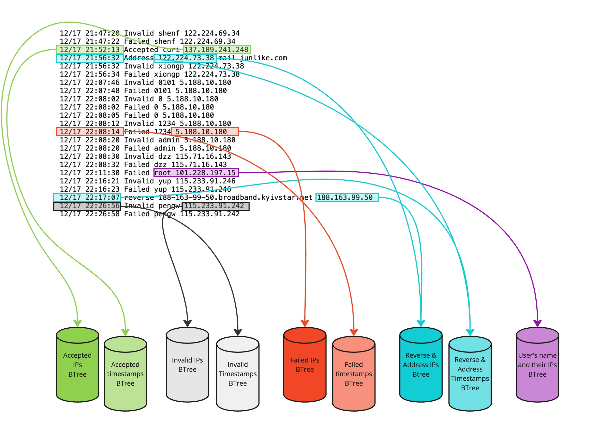

# CS 321 OpenSSH Server Log Project

**Table of contents:**
- [Learning Objectives](#learning-objectives)
- [Starter Code](#starter-code)
- [Scrum Process](#scrum-process)
- [Project Requirements](#project-requirements)

<hr/>

# Learning Objectives

- Develop a complex project in a team by applying good software engineering practices such
as  agile development, version control, and data persistence along with testing and code
instrumentation.
- Demonstrate effective teamwork as a member or a leader of a team.
- Design, implement, and evaluate a computing-based solution to a given set of computing
requirements for a problem from a specific domain.
- Learn how to implement a BTree external data structure on the disk.
- Learn how to wrangle raw data using regular expressions.
- Demonstrate  how to use caching to improve performance of an application.
- Demonstrate how to run an application in the cloud.

# Starter Code
This repository contains:
- the expected project package structure, in the [src/](src) folder
- some partial implementation of classes, in the [src/main/java/cs321/](src/main/java/cs321) folder
- sample [JUnit](https://junit.org/) tests, in the [src/test/java/cs321/](src/test/java/cs321) folder
    - note that we have provided a full unit test for the BTree class in `BTreeTest.java` class
- sample input data and expected results, in the [data/](data) folder
- a wrapper for the [gradle](https://gradle.org/) build tool, which simplifies installing and running gradle. In turn, gradle facilitates and handles:
    - Java library (e.g., JUnit) dependency management
    - Compiling the code
    - Generating self-containing jars
    - Running classes
    - Running unit tests

:heavy_exclamation_mark: **NOTE: Do NOT fork this repository**, because the forked repository
cannot have its own GitHub issues, which will be used as Scrum tasks.

:heavy_exclamation_mark: **NOTE: Do NOT modify the package structure in the [src/](src) folder**,
otherwise the project may not build correctly using gradle.

## Ensure that we have the correct JDK version
Use the following command to check our installed JDK version:
```bash
$ javac -version
```

This project **does not work** with JDK 24 (to be released in March 2025).

It is recommended to use any of the following versions:
- JDK 8 (LTS)
- JDK 11 (LTS)
- JDK 17 (LTS)
- JDK 21 (LTS)

:book: See this [wiki page for additional details regarding the
supported Java versions and links to download the correct JDK
versions](https://github.com/BoiseState/CS321_Cybersecurity/wiki/Install-the-correct-JDK-version).


## One-Time Team Setup
One team member should:
- Create a new **private** GitHub repository and
    - Make sure to name the private repository as specified by your instructor
    - Give repository write permissions to all the other team members
    - Add your instructor and teaching assistants as collaborators
	  (they will provide you with their GitHub ids)
- Clone (**not fork**) this repository and verify that gradle can be run.

```bash
$ git clone https://github.com/BoiseState/CS321_Cybersecurity.git
$ cd CS321_Cybersecurity
$ ./gradlew tasks
```

The last command should perform a one-time gradle setup, followed by listing all the available
gradle tasks and their descriptions.

**NOTE:** On Windows, the `./gradlew` command should be replaced with `gradlew` (which will
call the [`gradlew.bat`](/gradlew.bat) file)

The same team member should push the cloned repository to the new private repository.  This can
be done by changing the remote URL of the cloned repository to the new private repository's URL.

```bash
$ git remote set-url origin NEW_URL_OF_YOUR_NEW_PRIVATE_REPOSITORY
$ git remote -v
$ git push
```

The other team members should then clone the newly created student repository containing the
[starter code](#starter-code).

## Compile and Run the Project from the Command Line
Gradle allows running unit tests and code from IDEs, or the command line, as described below.

Run all the JUnit tests and print a summary of the results:
```bash
$ ./gradlew test
```

Note that if you initially run the tests, they will fail as you have not yet finished the project!

Run the `main` method from `SSHCreateBTree.java` and pass the [appropriate `<arguments>`](#51-program-arguments):
```bash
$ ./gradlew createJarSSHCreateBTree
$ java -jar build/libs/SSHCreateBTree.jar <arguments>
```

Run the `main` method from `SSHSearchBTree.java` and pass the [appropriate `<arguments>`](#51-program-arguments):
```bash
$ ./gradlew createJarSSHSearchBTree
$ java -jar build/libs/SSHSearchBTree.jar <arguments>
```

Run the `main` method from `SSHSearchDatabase.java` and pass the [appropriate `<arguments>`](#51-program-arguments):
```bash
$ ./gradlew createJarSSHSearchDatabase
$ java -jar build/libs/SSHSearchDatabase.jar <arguments>
```

## Run the project from an IDE: IntelliJ IDEA, VSCode or Eclipse

Note that the following wiki pages may refer for GeneBankCreateBTree --> simply replace that with
SSHCreateBtree. In general, replace GeneBank with SSH.

### Eclipse
This repository is an [Eclipse](https://www.eclipse.org/) project, and can be directly opened in
[Eclipse](https://www.eclipse.org/).

:book: See this [wiki page for additional instructions to run this project in Eclipse](https://github.com/BoiseState/CS321_Cybersecurity/wiki/Instructions-to-run-in-Eclipse).


### IntelliJ IDEA
This project can be opened with [IntelliJ IDEA](https://www.jetbrains.com/idea/).

:bulb: HINT: As a student, you can get [IntelliJ IDEA](https://www.jetbrains.com/idea/) for
free ([using an academic license](https://www.jetbrains.com/community/education/#students))
by signing up with your Boise State email.

:book: See this [wiki page for additional instructions to run this project in IntelliJ IDEA](https://github.com/BoiseState/CS321_Cybersecurity/wiki/Instructions-to-run-in-IntelliJ-IDEA).

### VSCode
Alternatively, this project can be opened with [VSCode](https://code.visualstudio.com/).

:book: See this [wiki page for detailed instructions to run this project in VSCode](https://github.com/BoiseState/CS321_Cybersecurity/wiki/Instructions-to-run-in-VSCode).

## Notes for creating additional files and tests, while keeping the Gradle project structure
We can add as many classes as we want in `src/main/java`, and gradle should build them automatically. 
In other words, we should not have to make any changes to the `build.gradle`.

Also, we can add new test files with new tests cases in `src/test/java` and those will be run
automatically by gradle or our IDE.

<hr/>

# Scrum Process
The focus of this project is to learn about data structures, while working effectively in a group.
In addition, given the small project scope, and the fixed set of requirements that are already
defined (and will not need to be elicited with the use of a Product Owner), the team can customize
the Scrum process learned in CS-HU 271 (or CS 208) and focus exclusively on: 
- creating tasks 
- linking commits to task IDs (e.g., `Implements task #123` or `Closes #123`) 
- Test-Driven Development and unit testing. The [starter code](#starter-code) already contains a few [sample unit tests](src/test/java/cs321)
that can be [run from the command line](#compile-and-run-the-project-from-the-command-line).

## Scrum Board
Creating the tasks upfront will allow dividing and assigning the work in order to provide
transparency and accountability within the team.

Use the [Projects](https://github.com/BoiseState/CS321_Cybersecurity/projects) tab (i.e., a
simplified version of [ZenHub](https://www.zenhub.com)) to configure our own team Scrum board,
based on this [project example](https://github.com/orgs/BoiseState/projects/124) (feel free to
copy the contents of these tasks to your Scrum board).

Your Scrum board should contain the following columns (pipelines):

| Column Name     | Description                                                                                              |
|-----------------|----------------------------------------------------------------------------------------------------------|
| Product Backlog | All (unassigned) tasks that are going to be completed by the team throughout the duration of the project |
| Sprint Backlog  | Tasks proposed to be implemented in the current week (sprint), assigned to developers                    |
| In Progress     | Tasks currently being worked on                                                                          |
| Review/QA       | Tasks ready to be reviewed by another team member                                                        |
| Closed          | Completed tasks, whose corresponding code is integrated in the `master` branch                           |

Tasks should be assigned to the developer working on them. Each team
member should add to the project log file, Project-Log.md, the tasks (e.g.,
`https://github.com/StudentUserNameHostingRepo/CS321_Cybersecurity/issues/123`) completed that
week, as described in the [progress reports](#11-progress-reports).

Here is an example of a [valid task](https://github.com/BoiseState/CS321_Cybersecurity/issues/3)
written in engineering language that is assigned to a developer. This task should be referenced
by a commit containing a message similar to `Implements task #3`.

As a warm-up exercise, each team member should create a task similar to 
[`task #2`](https://github.com/BoiseState/CS321_Cybersecurity/issues/2) and then edit the
[`README-submission.md`](README-submission.md) file with their information.

Here is a sample project log from a team from a previous semester:
[Project-Log-sample.md](https://github.com/BoiseState/CS321_Cybersecurity/blob/master/Project-log-sample.md)

<hr/>

# Project Requirements


**Table of contents:**
- [Introduction](#1-introduction)
- [Background](#2-background)
- [Specifications](#3-specifications)
- [Design Issues](#4-design-issues)
- [Implementation](#5-implementation)
- [Using a Cache](#6-using-a-cache)
- [Using a Database](#7-using-a-database)
- [Useful Examples](#8-useful-examples)
- [Test Scripts](#9-test-scripts)
- [Testing in the Cloud](#10-testing-in-the-cloud)
- [Progress Reports](#11-progress-reports)
- [Submission](#12-submission)


<hr/>

## 1. Introduction
In this Cybersecurity assignment, we will analyze server log files to better understand patterns in
the network traffic. For example, this can help us determine what locations do attacks most often
originate from, what times are the most common for attacks, among other possible insights. We
will look for and analyze patterns, activities, and operations within a server's log and then
store the corresponding data using multiple BTrees (separate BTrees for different patterns).

The amount of data that we have can be very large and any data structure is not likely to fit in
memory. Hence, BTrees are a good choice for the task at hand.  We will then store our findings
from the various BTrees into a single SQL database and analyze its results for patterns and
specific activities.

## 2. Background

If you are not familiar with internet, IP addresses, servers and clients, please watch [this
short video](https://www.youtube.com/watch?v=5o8CwafCxnU&ab_channel=Code.org)[7m] to give you
sufficient background for this project. If you are not familiar with using SSH (Secure Shell),
watch [this short video](https://www.youtube.com/watch?v=zlv9dI-9g1U&ab_channel=KarolCholewa)[2m]
to see how it is useful.

A SSH client connects to a SSH server software running on a remote system to get access to that
system. The SSH server tracks all access by writing the relevant information to a log file.

Log files are text files that store events, messages, and processes within a system and/or network.
They log information from users and are used to monitor server environments.  They can detect
when a network has become compromised or is under attack. For example, security logs check
successful and unsuccessful logins, application log failures, and other various activity within a
server. Secure Shell (SSH) is one of the most common ways of accessing remote servers. Therefore,
in this project we will use log files from a SSH server.  Below is an example of a Secure Shell
log file that is tracking activity within the server:

```
Dec 12 18:46:17 LabSZ sshd[31166]: Accepted password for suyuxin from 218.18.43.243 port 9480 ssh2
Dec 12 18:58:24 LabSZ sshd[31243]: Invalid user zouzhi from 115.71.16.143
Dec 12 18:58:26 LabSZ sshd[31243]: Failed password for invalid user zouzhi from 115.71.16.143 port 38790 ssh2
Dec 12 18:59:41 LabSZ sshd[31246]: Invalid user admin from 223.155.239.92
Dec 12 18:59:43 LabSZ sshd[31246]: Failed password for invalid user admin from 223.155.239.92 port 55156 ssh2
Dec 12 18:59:45 LabSZ sshd[31246]: Failed password for invalid user admin from 223.155.239.92 port 55156 ssh2
Dec 12 18:59:47 LabSZ sshd[31246]: Failed password for invalid user admin from 223.155.239.92 port 55156 ssh2
Dec 12 18:59:48 LabSZ sshd[31246]: Failed password for invalid user admin from 223.155.239.92 port 55156 ssh2
Dec 12 18:59:53 LabSZ sshd[31246]: Failed password for invalid user admin from 223.155.239.92 port 55156 ssh2
Dec 12 19:16:22 LabSZ sshd[31264]: Invalid user support from 103.79.141.173
Dec 12 19:20:39 LabSZ sshd[31269]: Accepted password for curi from 14.17.22.31 port 5154 ssh2
Dec 12 19:20:39 LabSZ sshd[31275]: Accepted password for curi from 14.17.22.31 port 5158 ssh2
Dec 12 19:23:51 LabSZ sshd[31474]: Invalid user xiawei from 115.71.16.143
Dec 12 19:23:53 LabSZ sshd[31474]: Failed password for invalid user xiawei from 115.71.16.143 port 54132 ssh2
Dec 12 19:31:09 LabSZ sshd[31479]: reverse mapping checking getaddrinfo for 190-174-14-217.speedy.com.ar 
                                   [190.174.14.217] failed - POSSIBLE BREAK-IN ATTEMPT!
Dec 12 21:02:41 LabSZ sshd[31596]: Address 123.16.30.186 maps to static.vnpt.vn, but this does not map back 
                                   to the address - POSSIBLE BREAK-IN ATTEMPT!
```

Each line shows a date and timestamp of an activity, the name of the server running the OpenSSH
Daemon (sshd) (with its process id), and the type of action followed by the user's name, IP address,
port number and SSH protocol version.

Note that the above example shows five types of actions denoted by the starting phrases:
`Accepted`, `Failed`, `Invalid`, `reverse`, or `Address`. Note that the last two types of
entries are the same for our analysis as they are both the same type of break-in attempts.
The full log file has a few other types of entries but those are not useful for our analysis.

With a quick scan of the above sample, we can see that there are multiple occurrences of failed
passwords, accepted passwords, and invalid users.  Upon closer look we can see that the block of
failed passwords happened within seconds, indicating that possibly a non-human entity (automated
script or an AI agent) was hitting the server multiple times!

The above log file sample is part of a larger [raw SSH log
file](https://drive.google.com/file/d/1JL-reDAedKBnw7jiz6iAaSxUwz6BwZil/view?usp=sharing) that
forms the basis for our SSH log file parsing and analysis. The raw file has 653781 lines, which
barely covers one month of logging at one server. Imagine how much larger this data would be
if we were looking at data for one year for a few hundred servers! You may download this file
and poke around in it.

There are many types of log files but the one we will focus on for this project comes from
[Zenodo-Loghub](https://zenodo.org/record/3227177#.ZEc9T-zMI-Q) dataset.


To get a feel for log file analysis,  please watch the following
helpful video that shows how to use Linux command line tools for analyzing
log files for specific patterns and attacks: 
[Analyzing Log Files For Attacks](https://www.youtube.com/watch?v=L2BFDyYknIg&ab_channel=Hackpens)[15m] 
(yes, this is a time-warped advertisement for CS153 :-))

However, the approach shown in video will be slow if we had hundreds of large log files.
Writing a custom program that not only processes the log files but converts them into a data
structure (and database) allows us to do faster analysis.


## 3. Specifications

### 3.1. Input Files and Data Wrangling
In data science, the process of [data wrangling](https://en.wikipedia.org/wiki/Data_wrangling),
also known as data munging, is the process of transforming and mapping data from one "raw"
data form into another format with the intent of making it more appropriate and valuable for
a variety of downstream purposes such as analytics.

The [raw SSH log
file](https://drive.google.com/file/d/1JL-reDAedKBnw7jiz6iAaSxUwz6BwZil/view?usp=sharing) (70MB)
contains lots of important data pertaining to the details of an activity. Note that this file
is hosted on Google Drive as it is larger than files allowed on GitHub.  Since we only need a
select few keywords to use within our BTree keys, it is easiest to strip the file to only the
necessary items. Below is the stripped version of the snippet from the log file (shown in the
previous section) that will be appropriate for creating our BTrees.

```
12/12 18:46:17 Accepted suyuxin 218.18.43.243
12/12 18:58:24 Invalid zouzhi 115.71.16.143
12/12 18:58:26 Failed zouzhi 115.71.16.143 
12/12 18:59:41 Invalid admin 223.155.239.92
12/12 18:59:43 Failed admin 223.155.239.92
12/12 18:59:45 Failed admin 223.155.239.92
12/12 18:59:47 Failed admin 223.155.239.92
12/12 18:59:48 Failed admin 223.155.239.92
12/12 18:59:53 Failed admin 223.155.239.92
12/12 19:16:22 Invalid support 103.79.141.173
12/12 19:20:39 Accepted curi 14.17.22.31
12/12 19:20:39 Accepted curi 14.17.22.31 
12/12 19:23:51 Invalid xiawei 115.71.16.143
12/12 19:23:53 Failed xiawei 115.71.16.143 
12/12 19:31:09 reverse 190.174.14.217
12/12 21:02:41 Address 123.16.30.186
```

Many keywords like `LabSZ`, `for`, `Dec`, `password`, and `sshd[xxxx]:` were removed, leaving only
the necessary information for creating our BTrees.  

Once the raw SSH text file has been wrangled, the file should have the following amounts of types.

| Type of Activity | Line count |
|------------------|------------|
| Accepted         | 181        |
| Address          | 497        |
| Failed           | 160,572    |
| Invalid          | 14,165     |
| reverse          | 18,909     |
| Total:          | 194,324    |


Note that we have already done this for you and provided the wrangled log file
(`data/SSH_Files/SSH_log.txt`) for you to use.  However, it is important for you to review the
process we used to simplify the raw log file into the simplified version we use to build the
BTrees for a few reasons.

- If you want to do the extra credit part where you write a Java data wrangler class.
- To understand how real life projects in cybersecurity, data science, and artificial intelligence
  often require complex data wrangling.
- To be exposed to using regular expressions in dealing with complex pattern matching in text.

### 3.1.1 Demo
Here is a [demo](demo/Log-File-Wrangling-Demo.md) that provides a walk-through of using a text
editor to wrangle and filter through certain keywords, phrases, and terms.

The conversion process uses [regular
expressions](https://en.wikipedia.org/wiki/Regular_expression), which are a powerful technique
for pattern matching in text files. Regular expressions are widely available in most programming
languages as well as in the Bash shell.


### 3.1.2 Data Wrangling Program (Extra Credit)
While using a text editor to wrangle the data is feasible for one file, it would be infeasible
if we have to do that for hundreds or thousands of log files. So for extra credit for this
project, please write a Java program named `SSHDataWrangler.java` to wrangle the raw SSH data
file into a useful form as described above. We will use regular expressions built into Java to
accomplish the task.

See this
[tutorial](https://www.vogella.com/tutorials/JavaRegularExpressions/article.html) for how to
use regular expressions in Java.

Note that we have included the final wrangled file (under the folder `data/SSH_Files`), so you
can `diff` your output with the final form to verify the correctness.

Please note that this part is **extra credit** so you can skip it and simply use the simplified
SSH log file that we have provided as part of the repository. Including the wrangled log file also
allows team members to proceed with other parts of the project sooner even if you do want to
attempt the extra credit!

### 3.2. The Main Problem

Now that we have data wrangling out of the way, the motivation for the main problem is to
analyze the frequency of certain activities and patterns within the log files; whether that be
most commonly accepted passwords at certain IPs, commonly failed passwords at specific times
of the day, or what common user's IPs are.

For the given log file, we want to convert its different activity types into various BTrees to
better analyze specific types of operations. We will make a total of **nine** BTrees, each with
a certain category of extracted data from the log file.

The following are the types of BTrees that will be created (the key value will be a combination of
the two fields that are used in each BTree):
- Accepted IPs (`accepted-ip`: Accepted log entry along with its IP address)
- Accepted timestamps (`accepted-timestamp`: Accepted log entry along with its timestamp)
- Failed IPs (`failed-ip`: Failed log entry along with its IP address)
- Failed timestamps (`failed-timestamp`: Failed log entry along with its timestamp)
- Invalid IPs (`invalid-ip`: Invalid log entry along with its IP address)
- Invalid timestamps (`invalid-timestamp`: Invalid log entry along with its timestamp)
- Reverse or Address IPs (`reverseaddress-ip`: Reverse or Address log entry along with its IP address)
- Reverse or Address timestamps (`reverseaddress-timestamp`: Reverse or Address log entry along with its timestamp)
- User's name and their IPs (`user-ip`: User name and IP address from all log entries)

See below for a visual of the nine types of BTrees.



Basically, each BTree has the key values along with their frequencies (the number of duplicates).
Once we have a BTree for each type of activity, we will then search the BTrees for the top
frequencies within each category and display those key values along with the frequencies. We
will also traverse each tree and put the results into a SQL database to make it easier for an
analyst to examine the data. We will also add a feature to dump each BTree into a dumpfile for
testing purposes.


## 4. Design Issues

### 4.1. Memory
We can represent the key from a SSH log line (from the stripped log file) as a string of 32
characters long (which would require 64 bytes).  No value should go over 32 characters but if
it does, then we simply truncate the sequence to just the first 32 characters. This would form
the key value.

Note that we always want to write a fixed size array on disk so that size of each TreeObject
is known ahead of time. In order to do that, we can pad each key to be 32 characters (by adding
spaces or null character at the end). We can also keep the key values to be their natural size
but pad them with null characters only when we store to the disk (and then remove the padding
when we read the key values back from the disk).

### 4.2. Key Values
Note that the key values will be the two variables of that BTree's type concatenated with a dash (`-`)

Examples:
- `Accepted-137.189.241.278`
- `Accepted-20:48`
- `Failed-122.224.69.34`
- `Failed-21:47`
- `Invalid-103.99.0.122`
- `Invalid-21:47`
- `reverse-123.16.30.186`
- `Address-123.16.30.186`
- `xiawei-115.71.16.143`

### 4.3. Class Design
We will need a `BTree` class as well as a `BTreeNode` class. The `BTreeNode` class may be an
inner class in the main `BTree` class. The objects that we store in the BTree will be similar
to the objects we stored in the previous `Hashtable` assignment. You should use the provided
class `TreeObject` to represent the objects using the `Comparable` interface.

### 4.4 Priority Queues

In order to find the top `k` keys (by frequency), we will need a priority queue in the search
programs. This is because the BTree is sorted by the key value and not by their frequencies. We
created our own priority queue in Project 2, but for  this project we will use the [Priority
Queue](https://docs.oracle.com/en/java/javase/21/docs/api/java.base/java/util/PriorityQueue.html)
class available from the standard library in Java. 

The Priority Queue will have the frequency as its primary key and the BTree key as its secondary
key (so the `compareTo` will use frequency first and then the BTree key next to ensure stable
sorting). This allows us to compare output against the expected output.

## 5. Implementation
We will create three (or four, if doing the extra credit part) programs:

- `SSHDataWrangler.java`: (*Optional -- Extra Credit*)  to **wrangle the raw SSH file** into the
form suitable for creating BTrees.

- `SSHCreateBTree.java`: to **create a BTree** from a given wrangled SSH log file and outputs
all unique values found within the SSH log file as a Random-Access-File file
containing the BTree, a dump file (if debug option is on), and as a table into a SQL database named
`SSHLogDB.db` (using an inorder traversal). Note that, in a real setting, we probably don't
want to dump the full BTree into the database! We do that here for testing purposes.

- `SSHSearchBTree.java`: for **searching a specified BTree** for the given key values. The
search program assumes that the user specified the appropriate BTree. Optionally, the user can
provide a top frequency count to use to output just the top occurring searched queries.

- `SSHSearchDatabase.java`: to **search in the SQL database** for the top occurring key values along
with their frequencies. This database would be created as a by-product of the `SSHCreateBTree.java`
program and contains all the keys from an inorder traversal for each BTree.


### 5.1. Program Arguments
The required arguments for the four programs are shown below:

```bash
java -jar build/libs/SSHDataWrangler.jar --rawSshFile=<raw-ssh-file> \
          --sshFile=<wrangled-ssh-file>

java -jar build/libs/SSHCreateBTree.jar --cache=<0/1> --degree=<btree-degree> \
          --sshFile=<ssh-File> --type=<tree-type> [--cache-size=<n>] \
          --database=<yes/no> [--debug=<0|1>]

java -jar build/libs/SSHSearchBTree.jar --cache=<0/1> --degree=<btree-degree> \
          --btree-file=<btree-filename> --query-file=<query-fileaname> \
          [--top-frequency=<10/25/50>] [--cache-size=<n>]  [--debug=<0|1>]

java -jar build/libs/SSHSearchDatabase.jar --type=<tree-type> \
          --database=<sqlite-database-path> --top-frequency=<10/25/50>
```

**Note that the arguments can be provided in any order.** The backslash represents that the command
is displayed on multiple lines but we would type it in one line (without the backslash).

- `<cache>` specifies whether the program should use cache (value `1`) or
no cache (value `0`); if the value is `1`, the `<cache-size>` has to be specified

- `<degree>` is the degree to be used for the BTree. If the user specifies `0`, then our
program should choose the optimum degree based on a disk block size of `4096` bytes and the
size of our BTree node on disk

- `<rawSshFile>` is the input `.txt` file containing the raw SSH log file

- `<sshFile>` is the input `.txt` file containing the wrangled SSH log file

- `<type>` is the type of BTree used and is one of nine options:
  - `accepted-ip`
  - `accepted-time`
  - `invalid-ip`
  - `invalid-time`
  - `failed-ip`
  - `failed-time`
  - `reverseaddress-ip`
  - `reverseaddress-time`
  - `user-ip`

- `<btree-file>` is the name of the BTree file generated by the `SSHCreateBTree` program. The name
  that should be used by `SSHCReateBTree` program should be of the form
  `SSH_log.txt.ssh.btree.<type>.<degree>`

- `<query-file>` contains the same SSH key pairs type (e.g., `Accepted-20:48` and `Accepted-21:32`)
that will then be searched for in the specified BTree file of the same type. The strings are
one per line and must align with the corresponding BTree file of the same type

- `<database>` allows the user to specify whether to create/add to `SSHLogDB.db` from the
  `SSHCreateBTree` program

- `<top-frequency>` is the most frequently occurring keys within a BTree type.  Gets either the top
`10`,`25`, or `50` values.  Note that the BTree type: `accepted-ip` does not have enough values
for `50` top values (i.e., total unique values for `accepted-ip` is `42`). For `SSHSearchBTree`, the
top-frequency is an optional argument. If it is not specified, then we simply return the search for
all keys in the `<query-file>`. Otherwise, we return the search for the top `<top-frequency>` keys
among the ones specified in the `<query-file>`

- `[<cache-size>]` is an optional argument, which is an integer between `100` and `10000` (inclusive)
that represents the maximum number of `BTreeNode` objects that can be stored in the memory cache

- `<database>` the path to the SQL database created after BTree creation for a specific BTree
type. The name of the database file should be `SSHLogDB.db`


- `[<debug>]` is an optional argument with a default value of zero

    - It must support at least the following values for `SSHSearchBTree`:

        - `0`: The output of the queries should be printed on the standard output stream. Any
        diagnostic messages, help and status messages must be printed on the standard error stream

		- `1`: The program displays more verbose messages as decided by the team

    - It must support at least the following values for `SSHCreateBTree`:

        - `0`: Any diagnostic messages, help and status messages must be printed on standard
        error stream

        - `1`: The program writes a text file named `dump-treetype.degree.txt`,
        ex. `dump-accepted-ip.0.txt`, containing the SSH key and corresponding frequency in an
        inorder traversal, and has the following line format:

```log
<SSH Key> <frequency>
```

The following shows a segment of the dumpfile `dumps/dump-user-ip.0.txt` (it has a total of 5294 lines).
```log
huangqx-115.71.16.143 20
huangt-183.136.169.234 2
huangzq-119.7.221.129 10
huawei-119.7.221.129 6
huawei-125.65.165.70 2
huawei-202.107.207.123 2
hub-87.120.255.161 2
huf-183.136.178.26 2
...
```

The following displays what each main driver must output:

| Class               | Output                                                                                                                                                                                               | 
|---------------------|------------------------------------------------------------------------------------------------------------------------------------------------------------------------------------------------------|
| `SSHCreateBTree`    | - `SSH_log.txt.ssh.btree.<type>.<degree>` file (in the current folder)<br/>- appropriately named table in `SSHLogDB.db` (database is in current folder) <br/>- `dump-<type>.<degree>.txt` (in the current folder)   if `<debug>`=`1` <br/> |
| `SSHSearchBTree`    | - output for the queries to standard out  |    
| `SSHSearchDatabase` | - top 10/25/50 `<SSH Key> <frequency>` to standard out |

### 5.2. Example Demonstration of Project


#### 5.2.1. (Optional: Extra Credit) Wrangle the raw data file

Please download the
[raw SSH log file](https://drive.google.com/file/d/1JL-reDAedKBnw7jiz6iAaSxUwz6BwZil/view?usp=sharing)
(70MB) from the Google Drive. Then wrangle it with your program as follows:

```bash
java -jar build/libs/SSHDataWrangler.jar --rawSshFile=SSH_log_raw.txt \
          --sshFile=SSH_log.txt
```

This program assumes that the raw file and output file are both in the top level of the project
folder.  Then compare the output file with the wrangled file that we have provided, as follows:

```bash
diff SSH_log.txt data/SSH_Files/SSH_log.txt
```

If it matches, there is no output (good news is no news).

#### 5.2.2. Create one BTree using `SSHCreateBTree`
Using the following command: 
```bash
java -jar build/libs/SSHCreateBTree.jar --cache=1 --degree=0 --sshFile=SSH_log.txt \
          --type=accepted-time --database=yes --cache-size=2000 --debug=1
```

Assumes that the wrangled log file is in the `data/SSH_Files` folder.

Outputs:
- BTree Random-Access-File file: `SSH_log.txt.ssh.btree.accepted-ip.0`
- Dump text file: `dump-accepted-ip.0.txt`
- Table name: `acceptedip` to `SSHLogDB.db`

See below for a snippet of the dump file  `dump-accepted-ip.0.txt`: 

| Key | Frequency |
|-------------------------|--------------------------------|
|Accepted-137.189.206.152 |  1 |
|Accepted-137.189.206.243 |  1 |
|Accepted-137.189.207.18  |  1 |
|Accepted-137.189.207.28  |  1 |
|Accepted-137.189.240.159 |  1 |
|Accepted-137.189.241.19  |  2 |
|Accepted-137.189.241.248 | 11 |
|Accepted-137.189.88.215  | 12 |
|Accepted-137.189.90.232  | 10 |
|Accepted-14.17.22.31     |  4 |
|Accepted-183.11.36.159   |  2 |
|Accepted-183.11.39.245   |  1 |
|Accepted-183.11.69.89    |  2 |
|Accepted-183.62.156.108  |  5 |
|Accepted-203.218.70.64   |  2 |
|Accepted-218.17.80.182   |  7 |
|Accepted-218.18.42.17    |  5 |
|Accepted-218.18.43.243   |  1 |
|Accepted-222.125.40.98   |  5 |
|Accepted-222.240.177.42  |  7 |
|Accepted-61.187.54.9     | 12 |
|Accepted-67.160.100.130  |  1 |
|Accepted-73.239.249.49   |  1 |


#### 5.2.3. Search BTree in `SSHSearchBTree`
With arguments of:
```bash
java -jar build/libs/SSHSearchBTree.jar --cache=0 --degree=0 \    
          --btree-file=SSH_log.txt.ssh.btree.accepted-time.0 \
          --query-file=QUERY-accepted-time.txt \
          --top-frequency=25 --cache-size=10000 --debug=0
```

Assumes that the query files are in `data/queries` folder.

Outputs:
- Query output: output of queries goes to standard out
- Note that the outut is sorted first by the frequency and then alphabetically by the key.

| Key                     |  Frequency |
|--------------------------------------------------|------------|
|Accepted-111.222.107.90  |25 |
|Accepted-119.137.63.195  |14 |
|Accepted-137.189.88.215  |12 |
|Accepted-61.187.54.9     |12 |
|Accepted-137.189.241.248 |11 |
|Accepted-137.189.90.232  |10 |
|Accepted-119.137.62.123  |9 |
|Accepted-218.17.80.182   |7 |
|Accepted-222.240.177.42  |7 |
|Accepted-113.116.236.34  |6 |
|Accepted-123.255.103.142 |5 |
|Accepted-123.255.103.215 |5 |
|Accepted-183.62.156.108  |5 |
|Accepted-218.18.42.17    |5 |
|Accepted-222.125.40.98   |5 |
|Accepted-14.17.22.31     |4 |
|Accepted-112.96.173.55   |3 |
|Accepted-112.96.33.40    |3 |
|Accepted-137.189.204.253 |3 |
|Accepted-113.118.187.34  |2 |
|Accepted-113.99.127.215  |2 |
|Accepted-137.189.205.44  |2 |
|Accepted-137.189.241.19  |2 |
|Accepted-183.11.36.159   |2 |
|Accepted-183.11.69.89    |2 |

#### 5.2.4. Search BTree Database in `SSHSearchDatabase`

With arguments of:
```bash
java -jar build/libs/SSHSearchDatabase.jar --database=SSHLogDB.db \
          --type=accepted-time --top-frequency=25 
```

Outputs to standard output stream:

| Key | Frequency                            |
|---------------|----------------------------|
|Accepted-14:20 | 5 |
|Accepted-18:46 | 4 |
|Accepted-00:02 | 3 |
|Accepted-15:45 | 3 |
|Accepted-09:17 | 2 |
|Accepted-09:21 | 2 |
|Accepted-09:22 | 2 |
|Accepted-10:39 | 2 |
|Accepted-11:40 | 2 |
|Accepted-12:53 | 2 |
|Accepted-14:42 | 2 |
|Accepted-15:16 | 2 |
|Accepted-16:14 | 2 |
|Accepted-17:00 | 2 |
|Accepted-18:03 | 2 |
|Accepted-19:11 | 2 |
|Accepted-19:20 | 2 |
|Accepted-19:22 | 2 |
|Accepted-19:26 | 2 |
|Accepted-20:15 | 2 |
|Accepted-00:03 | 1 |
|Accepted-00:11 | 1 |
|Accepted-00:17 | 1 |
|Accepted-00:22 | 1 |
|Accepted-00:43 | 1 |


### 5.3. Additional Implementation Remarks

#### 5.3.1. Your programs should always keep the root node in the memory
Write the root node to disk file only at the end of the program and read it in when the program
starts up. In addition, our program can only hold a few nodes in memory. In other words,
we can only use a few BTreeNode variables (including the root) in our program (e.g., root,
parent, current, child, temporary node for split). However, if the cache is enabled, we can
store `<cache-size>` `BTreeNode` objects in the cache.

#### 5.3.2. Metadata storage
We need to store some metadata about the BTree on disk. For example, we can store the degree
of the tree, the byte offset of the root node (so we can find it), the number of nodes, and other
information. This information should be stored at the beginning of the BTree file. We read the
metadata when we open the BTree file, and we write it back (as it may have changed) when we close
the BTree file at the end of the program.

#### 5.3.3. Layout of the BTree in the binary file 

The BTree is stored as a binary file on disk. This is the most efficient and compact way to
store the BTree data structure, so it persists beyond the program. While it is possible to
store the BTree as a text file, it will lead to severe slowdown in the runtime.

The BTree data file will have an initial metadata section. The metadata section should contain
at least the byte offset of the root node. It may also optionally contain the degree of the
BTree and the number of nodes.  After the metadata, the rest of the file consists of BTreeNodes
laid out one after the other. A new node is added to the end of the file.

#### 5.3.4 Reading and Writing Nodes

- We will read/write one BTreeNode at a time. If the degree `<t>` is small, this would be
inefficient. To improve efficient, we should set the degree `<t>` to an **optimum** value such
that a BTreeNode fits one disk block (we are using 4096 bytes for the disk block size) as full
as possible with some empty padding space at the end (if needed).

- We will store the byte offset of a node on disk as the child pointers in the BTreeNodes. Note
that we never need real child pointers in memory.

- We will use RandomAccessFile  and FileChannel classes to read/write to the BTree
data file. This allows us to quickly set the file cursor to anywhere in the file
in O(1) time using the `position(long pos)` method. We will use the ByteBuffer
class to read/write to the BTree data file.  Please see the example of writing
to a random access binary data file shown in DiskReadWrite.java in the [Disk IO
examples](https://github.com/BoiseState/CS321-resources/tree/master/examples/disk-IO-examples)
folder in CS321-resources repo. This example shows a complete binary search tree as an external
data structure in a binary file on disk.


## 6. Using a Cache
We will incorporate the generic Cache class from `Project 1` to improve the performance of our
BTree implementation. The size of the cache should be a command line argument. An entry in the
cache is a `BTreeNode`. With the cache enabled command line option, the `<cache-size>` needs to
be specified as between `100` and `10000` (inclusive).  Using the cache greatly speeds up the
execution time especially when searching larger BTrees.

## 7. Using a Database

Design a simple database to store the results (key values and frequencies) from the BTree.
We will perform an inorder tree traversal to get the information to store in the database with
the `<tree type>` as the table's name without the `-` (to prevent SQL syntax errors). This would
be done at the end of creating the SSH BTree. Afterwards, we will create a separate search
program named `SSHSearchDatabase` that uses the database instead of the BTree and the top
searched query list outputted by `SSHSearchBTree` to get the top frequencies of a certain BTree.

```bash
$ ./gradlew createJarSSHSearchDatabase
$ java -jar build/libs/SSHSearchDatabase.jar --type=<tree-type> --database=<SQLite-database-path> \
            --top-frequency=<10/25/50>
```

We will use the embedded SQLite database for this project.  The SQLite database is fully contained
in a jar file that gradle will automatically pull down for us. See the database example in the
section below on how to use SQLite.

### 7.1 Analyzing the Database

When searching for the top results in the database, we want to analyze the top key frequencies
for patterns.  The top keys should be printed out with their frequencies as demonstrated by
the following segment for top 10 keys in an `accepted-time` BTree.

```log
Accepted-14:20: 5
Accepted-18:46: 4
Accepted-15:45: 3
Accepted-00:02: 3
Accepted-20:15: 2
Accepted-19:22: 2
Accepted-19:20: 2
Accepted-19:11: 2
Accepted-12:53: 2
Accepted-11:40: 2
```

We observe from the code segment above that the top two accepted entries occur between `14:20`
and `18:46` with all other entries mostly distributed past `11:40`.  The majority of `Accepted`
occurrences happened between `12:00` to `19:15`.

Below represents the table for analyzing a select few BTrees for their top
results in their corresponding database and the questions to answer in a file named
[`BTree-Database-Analysis.md`](BTree-Database-Analysis.md) that you will add to your project.

| Tree Type             | degree | Question:                                                                                           |
|-----------------------|--------|-------------------------------------------------------------------------|
| `accepted-ip`         | 100    | What is the most common first three IP digits in the top 10 entries? (`137` at three times)         |
| `invalid-time`        | 100    | What is the range (highest-lowest) of the top 25 entries? (`55`-`42`=`13`)                          |
| `failed-ip`           | 100    | What is the first three digits of the top 2 entries of 50 total entries? (`183`)                    |
| `reverseaddress-ip`   | 100    | Is the top entry `reverse` or `Address` type in the top 25 entries? (`reverse`)                     |
| `reverseaddress-time` | 100    | Which hour was the most predominant for a reverse break in attempt in the top 25 entries? (`11:00`) |
| `user-ip`             | 100    | Who is the predominant user in the top 25 entries? (`root`)                    |


## 8. Useful Examples

The following examples from the class examples repository will be useful for this project.

- [Disk ReadWrite example](https://github.com/BoiseState/CS321-resources/tree/master/examples/disk-IO-examples): In
  particular, look at DiskReadWrite.java. It shows the implementation of an external binary
  search tree on disk.
- [SQLite example](https://github.com/BoiseState/CS321-resources/tree/master/examples/SQLite): A
  quick starter example on how to set up and use SQLite.

## 9. Test Scripts

The wrangled SSH Log file is provided in the folder:
[data/SSH_Files](https://github.com/BoiseState/CS321_Cybersecurity/tree/master/data/SSH_Files).

The expected dump files and query results are provided in the folders:
[results/dump-files](results/dump-files),
[results/btree-search](results/btree-search)
[results/db-search](results/db-search)

Six test scripts are provided at the top-level of the project (for integration testing). These
compare your results to the results files mentioned above.  You can use the test scripts to
run and compare results using the four test scripts as follows.

```bash
./gradlew createJarSSHCreateBTree
./gradlew createJarSSHSearchBTree
./gradlew createJarSSHSearchDatabase

./create-btrees.sh 
./check-dump-files.sh 

./search-btrees.sh 
./check-btree-search.sh 

./search-db.sh
./check-db-search.sh

```

The `create-btrees.sh` script creates all nine BTree types from the SSH Log file. As a side effect,
it also creates the dump files and the SQL database that contains tables for each of the nine types
of key values. The script will move your BTrees, dump files to the appropriate subfolder in the
folder `output` in the repo.

The `check-dump-files.sh` compares the dump files from our code to the reference dump files.

The `search-btrees.sh` script searches all nine BTrees from the BTree files for all the  key
values found in the nine BTrees as well as just the top 25 entries.  The script will store your
output to the subfolder `btree-search` under the `output` folder.

The `check-btree-search.sh` script compares the results of search queries from searching
the BTree to the reference results.

The `search-db.sh` script searches the database for the top 25 entries for each of the key value
types.  The script will store your output to the subfolder `db-search` under the `output` folder.

The `check-db-search.sh` script compares the results from the database to the reference results.

The instructors will also use these test scripts for the final testing of your project.  Start off
by running the tests on your machine. 

## 10. Testing in the Cloud

We will set up [Amazon AWS](https://aws.amazon.com/) accounts for each student so that you can
run larger tests in the cloud. **Running our tests on AWS is required, so we can all get some
more experience using the cloud.** :cloud: :smiley:

Please see the [AWS
notes](https://docs.google.com/document/d/1v5a0XlzaNyi63TXXKP4BQsPIdJt4Zkxn2lZofVP8qqw/edit?usp=sharing)
for a step-by-step guide on running your project on the AWS cloud. 

## 11. Progress Reports

Each team member will fill out a progress report (via a survey) each week. The link to the
survey will be  provided by the instructor.

In addition, each team member should log their project-related
activities for the week, including the URL to the tasks (e.g.,
`https://github.com/StudentUserNameHostingRepo/CS321_Cybersecurity/issues/123`) completed that
week, in a separate file named `Project-Log.md`.

Here is a sample log file:
[Project-log-sample.md](https://github.com/BoiseState/CS321_Cybersecurity/tree/master/Project-log-sample.md)

As a reminder, each commit should link (reference) in the commit message the completed task
(e.g., `Implements task #123`), in order to automatically link the task to the commit, and make
the code changes directly available from the task itself.

It is expected that each team should have at least one meeting every week.

Progress reports are confidential.

## 12. Submission
Before submission, make sure that:
- `BTree-Database-Analysis.md` is complete
- `README-submission.md` file is complete!
- you can [compile and run the program from the command line](#compile-and-run-the-project-from-the-command-line) and obtain the expected results 
- you run the [test scripts](#9-test-scripts)
- to add a note in your `README-submission.md` that the team is done and then commit and push.

Make sure the [instructor and the teaching assistant(s) have access to the repository](#one-time-team-setup).
