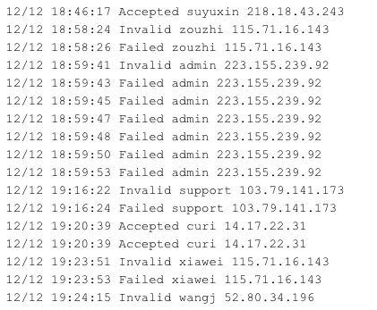
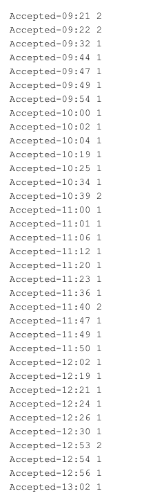
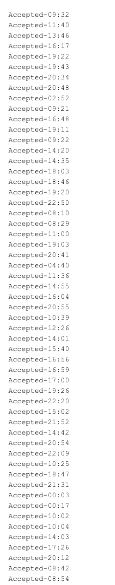
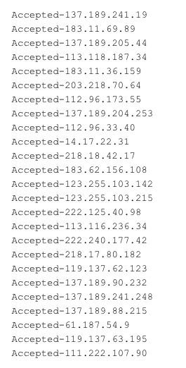

# CS 321 OpenSSH Server Log Project

**Table of contents:**
- [Learning Objectives](#learning-objectives)
- [Starter Code](#starter-code)
- [Scrum Process](#scrum-process)
- [Project Requirements](#project-requirements)

<hr/>

# Learning Objectives

- Develop a complex project in a team by applying good software engineering practices such as  agile development, version control, and data persistence along with 
testing and code instrumentation.
- Demonstrate effective teamwork as a member or a leader of a team.
- Design, implement, and evaluate a computing-based solution to a given set of computing requirements for a problem from a specific domain.
- Learn how to implement a B-Tree external data structure on the disk.
- Demonstrate  how to use caching to improve performance of an application.
- Understand how bitwise operators reduce the memory footprint of data.
- Learn how to run an application in the cloud.

# Starter Code
This repository contains:
- the expected project package structure, in the [src/](src) folder
- some partial implementation of classes, in the [src/main/java/cs321/](src/main/java/cs321) folder
- sample [JUnit](https://junit.org/) tests, in the [src/test/java/cs321/](src/test/java/cs321) folder
- sample input data and expected results, in the [data/](data) folder
- a wrapper for the [gradle](https://gradle.org/) build tool, which simplifies installing and running gradle. In turn, gradle facilitates and handles:
    - Java library (e.g., JUnit) dependency management
    - Compiling the code
    - Generating self-containing jars
    - Running classes
    - Running unit tests

:heavy_exclamation_mark: **NOTE: Do NOT fork this repository**, because the forked repository
cannot have its own GitHub issues, which will be used as Scrum tasks.

:heavy_exclamation_mark: **NOTE: Do NOT modify the package structure in the [src/](src) folder**,
otherwise the project may not be built correctly using gradle.

## Ensure that we have the correct JDK version
Use the following command to check our installed JDK version:
```bash
$ javac -version
```

This project **does not work** with JDK 22.

It is recommended to use any of the following versions:
- JDK 8 (LTS)
- JDK 11 (LTS)
- JDK 17 (LTS)
- JDK 21 (LTS)

:book: See this 
[wiki page for additional details regarding the supported Java versions and links to download the correct JDK versions](https://github.com/BoiseState/CS321_Cybersecurity/wiki/Install-the-correct-JDK-version).


## One-Time Team Setup
One team member should:
- Create a new **private** GitHub repository and
    - Make sure to name the private repository as specified by your instructor
    - Give repository write permissions to all the other team members
    - Add your instructor and teaching assistants as collaborators
	  (they will provide you with their GitHub ids)
- Clone (**not fork**) this repository and verify that gradle can be run.

```bash
$ git clone https://github.com/BoiseState/CS321_Cybersecurity.git
$ cd CS321_Cybersecurity
$ ./gradlew tasks
```

The last command should perform a one-time gradle setup, followed by
listing all the available gradle tasks and their descriptions.

**NOTE:** On Windows, the `./gradlew` command should be replaced with `gradlew`
(which will call the [`gradlew.bat`](/gradlew.bat) file)

The same team member should push the cloned repository to the new private repository.  This can
be done by changing the remote URL of the cloned repository to the new private repository's URL.

```bash
$ git remote set-url origin NEW_URL_OF_YOUR_NEW_PRIVATE_REPOSITORY
$ git remote -v
$ git push
```

The other team members should then clone the newly created student repository containing the
[starter code](#starter-code).

## Compile and Run the Project from the Command Line
Gradle allows running unit tests and code from IDEs, or the command line, as described below.

Run all the JUnit tests and print a summary of the results:
```bash
$ ./gradlew test
```

Run the `main` method from `SSHCreateBTree.java` and pass the [appropriate `<arguments>`](#51-program-arguments):
```bash
$ ./gradlew createJarSSHCreateBTree
$ java -jar build/libs/SSHCreateBTree.jar <arguments>
```

Run the `main` method from `SSHSearchBTree.java` and pass the [appropriate `<arguments>`](#51-program-arguments):
```bash
$ ./gradlew createJarSSHSearchBTree
$ java -jar build/libs/SSHSearchBTree.jar <arguments>
```


## Run the project from an IDE: IntelliJ IDEA, VSCode or Eclipse
### Eclipse
This repository is an [Eclipse](https://www.eclipse.org/) project, and can be directly opened in
[Eclipse](https://www.eclipse.org/).

:book: See this [wiki page for additional instructions to run this project in Eclipse](https://github.com/BoiseState/CS321_Cybersecurity/wiki/Instructions-to-run-in-Eclipse).

### IntelliJ IDEA
This project can be opened with [IntelliJ IDEA](https://www.jetbrains.com/idea/).

:bulb: HINT: As a student, you can get [IntelliJ IDEA](https://www.jetbrains.com/idea/) for free ([using an academic license](https://www.jetbrains.com/community/education/#students)) 
by signing up with your Boise State email.

:book: See this [wiki page for additional instructions to run this project in IntelliJ IDEA](https://github.com/BoiseState/CS321_Cybersecurity/wiki/Instructions-to-run-in-IntelliJ-IDEA).

### VSCode
Alternatively, this project can be opened with [VSCode](https://code.visualstudio.com/).

:book: See this [wiki page for detailed instructions to run this project in VSCode](https://github.com/BoiseState/CS321_Cybersecurity/wiki/Instructions-to-run-in-VSCode).

## Notes for creating additional files and tests, while keeping the Gradle project structure
We can add as many classes as we want in `src/main/java`, and gradle should build
them automatically. In other words, we should not have to make any changes to the `build.gradle`.

Also, we can add new test files with new tests cases in `src/test/java` and those will be run
automatically by gradle or our IDE.

<hr/>

# Scrum Process
The focus of this project is to learn about data structures, while working effectively in a group.
In addition, given the small project scope, and the fixed set of requirements that are already
defined (and will not need to be elicited with the use of a Product Owner), the team can
customize the Scrum process learned in CS-HU 271 and focus exclusively on:
- creating tasks
- linking commits to task IDs (e.g., `Implements task #123`)
- Test-Driven Development and unit testing. The [starter code](#starter-code) already contains a few [sample unit tests](src/test/java/cs321) that 
can be [run from the command line](#compile-and-run-the-project-from-the-command-line).

## Scrum Board
Creating the tasks upfront will allow dividing and assigning the work in order to provide
transparency and accountability within the team.

Use the [Projects](https://github.com/BoiseState/CS321_Cybersecurity/projects) tab (i.e., a simplified version
of [ZenHub](https://www.zenhub.com)) to configure our own team Scrum board,
based on this [project example](https://github.com/BoiseState/CS321_Cybersecurity/projects/1)
(feel free to copy the contents of these tasks to your Scrum board).

Your Scrum board should contain the following columns (pipelines):

| Column Name     | Description                                                                                              |
|-----------------|----------------------------------------------------------------------------------------------------------|
| Product Backlog | All (unassigned) tasks that are going to be completed by the team throughout the duration of the project |
| Sprint Backlog  | Tasks proposed to be implemented in the current week (sprint), assigned to developers                    |
| In Progress     | Tasks currently being worked on                                                                          |
| Review/QA       | Tasks ready to be reviewed by another team member                                                        |
| Closed          | Completed tasks, whose corresponding code is integrated in the `master` branch                           |

Tasks should be assigned to the developer working on them. Each team
member should add to the project log file, Project-Log.md, the tasks (e.g.,
`https://github.com/StudentUserNameHostingRepo/CS321_SSH_Logs/issues/123`) completed that
week, as described in the [progress reports](#11-progress-reports).

Here is an example of a [valid task](https://github.com/BoiseState/CS321_SSH/issues/3)
written in engineering language that is assigned to a developer. This task should be referenced
by a commit containing a message similar to `Implements task #3`.

As a warmup exercise, each team member should create a task similar to [`task
#2`](https://github.com/BoiseState/CS321_SSH/issues/2) and then edit the
[`README-submission.md`](/Written-Work/README-submission.md) file with their information.

Here is a sample project log from a team from a previous semester:
[Project-Log-sample.md](https://github.com/BoiseState/CS321_/ssh/blob/master/Project-log-sample.md)

<hr/>

# Project Requirements


**Table of contents:**
- [Introduction](#1-introduction)
- [Background](#2-background)
- [Specifications](#3-specifications)
- [Design Issues](#4-design-issues)
- [Implementation](#5-implementation)
- [Using a Cache](#6-using-a-cache)
- [Using a Database](#7-using-a-database)
- [Useful Examples](#8-useful-examples)
- [Test Scripts](#9-test-scripts)
- [Testing in the Cloud](#10-testing-in-the-cloud)
- [Progress Reports](#11-progress-reports)
- [Submission](#12-submission)


<hr/>

## 1. Introduction
In this assignment, we will analyze log files to better understand network observability within
the field of Cybersecurity.  We will look and observe patterns, activities, and operations
within a system's server and house the corresponding data using B-Trees.   The amount of data
that we have is large and any data structure is not likely to fit in memory, hence why B-Trees
being a good choice for the task at hand.  We will then store our findings in a database and
analyze its results for patterns and specific activities.

## 2. Background
Log files are textual data files that store events, messages, and processes within a system/network.  They log information from users and monitor IT environments.  They can detect when a 
network has become compromised or is under attack. For example, security logs check successful and unsuccessful logins, application log failures, and other various activity within a server.  Below is an example 
of a Secure Shell (SSH) log file tracking activity within the server:


The above details a date and timestamp of an activity, a server using OpenSSH Daemon (sshd) hosting the activity, and a type of activity committed by a user's name 
and IP location to a specific port.  

We can see that there are multiple occurrences of failed passwords, accepted passwords, and invalid users through a quick scan of the log file.  Upon closer look we can see that the block of failed 
passwords happened within milliseconds, indicating that a non-human entity was hitting the server multiple times within the 0.1 seconds!

The above log file sample is part of a larger [SSH log file](data/SSH_Files/SSH_log_UnParsed.txt) that will be used for our SSH log file parsing and analysis.  There are many types of log files but the one we will focus 
on for this project comes from [Zenodo-Loghub]("https://zenodo.org/record/3227177#.ZEc9T-zMI-Q) dataset.


Digging deeper, here is a helpful video for a big picture on simple approach in analyzing log files for specific patterns and attacks:
[Basic Approach: Analyzing Files Log For Attacks (2021)](https://www.youtube.com/watch?v=-T6oue5E4KQ)


## 3. Specifications

### 3.1. Input Files
The [SSH log file](data/SSH_Files/SSH_log_UnParsed.txt) contains lots of important data pertaining to the details of an activity.  Since we only need a select few 
keywords to use within our B-Tree keys, it is easiest to strip the file to only the necessary items. Below is a stripped version of the above file that will greatly 
help in parsing through the log files to create the proper B-Tree keys.  



Many key words like `LabSZ`, `for`, `Dec`, `password`, and `sshd[xxxx]:` are removed leaving only the necessary terms for creating our B-Trees.  Here is a [demo](demo/Log-File-Parsing-Demo.md) link that provides a walkthrough on how to parse and filter through certain keywords, phrases, and terms. 

Once the [raw SSH text file](data/SSH_Files/SSH_log_UnParsed.txt "Actual file to use for B-Tree") has been parsed, the file should have the below amounts
of types that you can verify against your parsing:

| Type of Activity | Line count |
|------------------|------------|
| Accepted         | 181        |
| Address          | 497        |
| Failed           | 160,572    |
| Invalid          | 14,165     |
| reverse          | 18,909     |
| Totals:          | 194,324    |


### 3.1.1 Demo
An example [demo](Demo/Log-File-Parsing-Demo.md "Demo") for filtering a log file is available to aid in reducing irrelevant log file information and explore Regular Expressions. 

### 3.2. Problem

The motivation for the problem is to analyze the frequency of certain activities and patterns within the log files; whether that be most commonly accepted 
passwords at certain IPs, commonly failed passwords at specific times of the day, or what common user's IPs are.

For the given log file, we want to convert its different activity types into various B-Trees to better analyze specific types of operations, i.e. we will 
make 9 total B-Trees with a certain category of extracted data from the log file.

The following are the types of B-Trees that will be created:
- Accepted IPs
- Accepted timestamps
- Failed IPs
- Failed timestamps
- Invalid IPs
- Invalid timestamps
- Reverse & Address IPs
- Reverse & Address timestamps
- User's name and their IPs

Once we have each B-Tree for each type of activity, we will then search the B-Trees for the top frequencies within each category and display those frequencies
from searching an SQL database.

The following displays what each main driver must output:

| Class               | Output                                                                                                                                                                                               | 
|---------------------|------------------------------------------------------------------------------------------------------------------------------------------------------------------------------------------------------|
| `SSHCreateBTree`    | - `QUERY:<tree-type>.txt`<br/>- RAF `SSH_lig.txtssh.btree<tree-type><degree>` file<br/>- `dump:<tree-type><degree>.txt` (`<debug>`=`1`) <br/>- `SSHLogDB.db` from the dump file (`<debug>`=`1`)<br/> |
| `SSHSearchBTree`    | - `SQUERY:<tree-type><topfrequency>.txt`                                                                                                                                                             | 
| `SSHSearchDatabase` | - top `<SSH Key> <frequency>` to standard out stream                                                                                                                                                 |


## 4. Design Issues

### 4.1. Memory
We could represent each SHH Log sequence as a string of that is 32 bytes long.  No value should go over 32 bytes and if so, we simply 
truncate the sequence to just 32 bytes. 

### 4.2. Key Values
Note that the key values will be the two variables of that B-Tree's type concatenated with a dash (`-`)

Examples:
 - `Accepted-20:48`
 - `Invalid-103.99.0.122`
 - `Address-123.16.30.186`
 - `xiawei-115.71.16.143`

### 4.3. Class Design
We will need a `BTree` class as well as a `BTreeNode` class. The objects that we store in the
B-Tree will be similar to the objects we stored in the previous `Hashtable` assignment. You should
call the relevant class `TreeObject` to represent the objects using the Comparable interface.

## 5. Implementation
We will create three programs:
- one that **creates a B-Tree** from a given parse SSH log file and outputs a query with all unique values found within the SHH log file, an
RAF file of the B-Tree, a dump file (if applicable), and an SQL Database (if applicable).
- another for **searching a specified B-Tree** for top occurring activity pairs. The search program
assumes that the user specified the proper B-Tree and top frequency count to use to output the top occurring searched queries.
- a final for **searching in the SQL database** for the top occurring activities pairs. This database
  would be created as a by-product of the first program and print the top search queries from searching the BTree.

The main Java classes should be named `SSHCreateBTree`, `SSHSearchBTree`, and `SSHSearchDatabase`.

### 5.1. Program Arguments
The required arguments for the three programs are shown below:

```bash
java -jar build/libs/SSHCreateBTree.jar --cache=<0/1> --degree=<btree-degree> --sshFile=<ssh-File> 
    --type=<tree-type> [--size=<n>]  [--debug=<0|1>]


java -jar build/libs/SSHSearchBTree.jar --cache=<0/1> --degree=<btreebdegree> 
  --btreefile=<bTree-file> --queryfile=<query-file> --topfrequency=<10/25/50> 
  [--size=<n>]  [--debug=<0|1>]

java -jar build/libs/SSHSearchDatabase.jar --database=<SQLite-database-path> 
      --searchqueryfile=<search-query-file>
```

**Note that the arguments can be provided in any order.**

- `<cache>` specifies whether the program should use cache (value `1`) or
no cache (value `0`); if the value is `1`, the `<cache-size>` has to be specified

- `<degree>` is the degree to be used for the B-Tree. If the user specifies `0`, then our
program should choose the optimum degree based on a disk block size of `4096` bytes and the
size of our B-Tree node on disk

- `<sshFile>` is the input `.txt` file containing the SSH log file

- `<type>` is the type of B-Tree used and is one of nine options:
  - `accepted-ip`
  - `accepted-time`
  - `invalid-ip`
  - `invalid-time`
  - `failed-ip`
  - `failed-time`
  - `reverseaddress-ip`
  - `reverseaddress-time`
  - `user-ip`

- `<btreefile>` is the name of the B-Tree file generated by the `SSHCreateBTree` program

- `<queryfile>` contains the same SSH key pairs type (ex. `Accepted-20:48` and `Accepted-21:32`) that will then be 
searched for in the specified B-Tree file of the same type. The strings are one per line and must align
with the corresponding B-Tree file of the same type.  

- `<topfrequency>` is the most frequent occurring keys within a B-Tree.  Gets either the top `10`,`25`, or `50` values.  Note B-Tree 
type: `accepted-ip` does not have enough values for `50` top values (i.e. total unique values for `accepted-ip` is `42`).    

- `[<size>]` is an integer between `100` and `10000` (inclusive) that represents the
maximum number of `BTreeNode` objects that can be stored in memory

- `<database>` the path to the SQL database created after B-Tree creation for a
specific B-Tree type. The name of the database file should be `SSHLogDB.db`

- `<searchqueryfile>` contains the same **top** SSH key pairs type (ex. `Accepted-20:48` and `Accepted-21:32`) 
that will then be searched for in the `.db` database file to a specific B-Tree database of the same type. The strings are one per line and must align
  with the corresponding `.db` B-Tree file of the same type outputted by SSHCreateBTree.  These files are to contain either `10`/`25`/`50` top keys
  depending on the specified `<topfrequency>` of the `SSHCreateBTree` output search query.

- `[<debug>]` is an optional argument with a default value of zero

    - It must support at least the following values for `SSHSearchBTree`:

        - `0`: The output of the queries should be printed on the standard output stream. Any
        diagnostic messages, help and status messages must be printed on the standard
        error stream

		- `1`: The program displays more verbose messages. For example, it prints the `PriorityQueue`'s contents upon completion.

    - It must support at least the following values for `SSHCreateBTree`:

        - `0`: Any diagnostic messages, help and status messages must be printed on standard
        error stream

        - `1`: The program writes a text file named `dump:treetype.degree`, ex. `dump:accepted-ip0`, 
      containing the SSH key and corresponding frequency in an inorder traversal, and has the following
        line format:

```bash
<SSH Key> <frequency>
```

The following shows a segment of the dumpfile `dumps/dump:user-ip0`. It has a total of 5294 lines!
```bash
huangqx-115.71.16.143 20
huangt-183.136.169.234 2
huangzq-119.7.221.129 10
huawei-119.7.221.129 6
huawei-125.65.165.70 2
huawei-202.107.207.123 2
hub-87.120.255.161 2
huf-183.136.178.26 2
...
```
### 5.2. Example Demonstration Walkthrough of Project

#### 5.2.1. Create B-Tree in `SSHCreateBTree`
With arguments of: 
```bash
java -jar build/libs/SSHCreateBTree.jar --cache=1 --degree=0 --sshFile=SSH_log.txt --type=accepted-time --size=2000  --debug=1
```

Outputs:
- Dump text file: `dump:accepted-ip0`
- Query file: `QUERY:accepted-ip.txt`
- B-Tree RAF file: `SSH_log.txt.ssh.btree.accepted-ip.0`
- Table name: `acceptedip` to `SSHLogDB.db`


| Snippet of Dump file - `dump:accepted-ip0`:              | Snippet of Query file - `QUERY:accepted-ip.txt`:               |
|----------------------------------------------------------|----------------------------------------------------------------|
|  |  |


#### 5.2.2. Search B-Tree in `SSHSearchBTree`
With arguments of:
```bash
java -jar build/libs/SSHSearchBTree.jar --cache=0 --degree=0 --btreefile=SSH_log.txt.ssh.btree.accepted-time.0 --queryfile=QUERY:accepted-time.txt --topfrequency=25 --size=10000 --debug=0
```

Outputs:
- Search query text file: `SQUERY:accepted-ip25.txt`

| SQuery file - `SQUERY:accepted-ip25.txt`:                      |
|----------------------------------------------------------------|
|  |

#### 5.2.3. Search B-Tree Database in `SSHSearchDatabase`

With arguments of:
```bash
java -jar build/libs/SSHSearchDatabase.jar --database=SSHLogDB.db --sQueryfile=SQUERY:accepted-time25.txt
```

Outputs to standard output stream:
- The `PriorityQueue` of top keys and their frequencies

| Prints to standard output stream:                            |
|--------------------------------------------------------------|
|  |


### 5.3. Additional Implementation Remarks

#### 5.3.1. Your programs should always keep the root node in the memory
Write the root node to disk file only at the end of the program and read it in when the program
starts up. In addition, our program can only hold a few nodes in memory. In other words,
we can only use a few BTreeNode variables (including the root) in our program (e.g., root,
parent, current, child, temporary node for split). However, if the cache is enabled, we can
store `<cache-size>` `BTreeNode` objects in the cache.

#### 5.3.2. Metadata storage
We need to store some metadata about the B-Tree on disk. For example, we can store the degree
of the tree, the byte offset of the root node (so we can find it), the number of nodes, and other
information. This information should be stored at the beginning of the B-Tree file. We read the
metadata when we open the B-Tree file, and we write it back (as it may have changed) when we close
the B-Tree file at the end of the program.

#### 5.3.3. Layout of the B-Tree in the binary file 

The B-Tree is stored as a binary file on disk. This is the most efficient and compact way to
store the B-Tree data structure, so it persists beyond the program. While it is possible to
store the B-Tree as a text file, it will lead to severe slowdown in the runtime.

The B-Tree data file will have an initial metadata section. The metadata section should contain
at least the byte offset of the root node. It may also optionally contain the degree of the
B-Tree and the number of nodes.  After the metadata, the rest of the file consists of BTreeNodes
laid out one after the other. A new node is added to the end of the file.

#### 5.3.4 Reading and Writing Nodes

- We will read/write one BTreeNode at a time. If the degree `<t>` is small, this would be
inefficient. To improve efficient, we should set the degree `<t>` to an **optimum** value such
that a BTreeNode fits one disk block (we are using 4096 bytes for the disk block size) as close
as possible with some empty padding space at the end (if needed).

- We will store the byte offset of a node on disk as the child pointers in the BTreeNodes. Note
that we never need real child pointers in memory.

- We will use RandomAccessFile  and FileChannel classes to read/write to the B-Tree
data file. This allows us to quickly set the file cursor to anywhere in the file
in O(1) time using the `position(long pos)` method. We will use the ByteBuffer
class to read/write to the B-Tree data file.  Please see the example of writing
to a random access binary data file shown in DiskReadWrite.java in the [Disk IO
example](https://github.com/BoiseState/CS321-resources/tree/master/examples/disk-IO-examples)
folder in CS321-resources repo. This example shows a complete binary search tree as an external
data structure in a binary file on disk.  Another source comes from this StackOverFlow post:
[Strings-to-ByteBuffer](https://stackoverflow.com/questions/24633980/java-nio-bytebuffer-put-and-get-strings) on writing and 
reading strings to a `ByteBuffer`. 


## 6. Using a Cache
We will incorporate the generic Cache class from `Project 1` to improve the performance of
our B-Tree implementation. The size of the cache should be a command line argument. An entry
in the cache is a `BTreeNode`. With the cache enabled command line option, the `<size>`
needs to be specified as well as in between size: `100` and `10000` (inclusive).  Using the cache
greatly speeds up the execution time especially when searching larger B-Trees.

## 7. Using a Database 

Design a simple database to store the results (sequences and frequencies) from the B-Tree.
We will perform an inorder tree traversal to get the information to store in the database with the 
`<tree type>` as the table's name without the `-` (prevents SQL syntax errors). This would be done at the end of creating the SSH B-Tree. Afterwards, we 
will create a separate search program named `SSHSearchDatabase` that uses the database instead of the 
BTree and the top searched query list outputted by `SSHSearchBTree` to get the top frequencies of a certain B-Tree.

```bash
$ ./gradlew createJarSSHSearchDatabase
$ java -jar build/libs/SSHSearchDatabase.jar --database=<SQLite-database-path> 
      --queryfile=<query-file>
```

We will use the embedded SQLite database for this project.  The SQLite database is fully
contained in a jar file that gradle will automatically pull down for us. See the database
example in the section below on how to use SQLite.

### 7.1 Analyzing the Database

When searching for the top results in the database, we want to analyze the top key frequencies for patterns.  The top keys should be printed out with their 
frequencies as demonstrated by the following segment for top 10 keys in an `accepted-time` B-Tree.
```
Accepted-20:15: 2
Accepted-12:53: 2
Accepted-19:11: 2
Accepted-19:20: 2
Accepted-11:40: 2
Accepted-19:22: 2
Accepted-15:45: 3
Accepted-00:02: 3
Accepted-18:46: 4
Accepted-14:20: 5
```
We observe from the code segment above that the top two accepted entries occur between `14:20` and `18:46` with all other entries mostly distributed past `11:40`.  The majority of `Accepted` 
occurrences happening between `12:00` to `19:15`.  

Below represents the table for analyzing a select few B-Trees for their top results in their corresponding database and the questions to answer in [`BTree-Database-Analysis.md`](Written-Work/BTree-Database-Analysis.md).

| Tree Type             | degree | cache | cache size | debug | Question:                                                                                           |
|-----------------------|--------|-------|------------|-------|-----------------------------------------------------------------------------------------------------|
| `accepted-ip`         | 100    | yes   | 10000      | 1     | What is the most common first three IP digits in the top 10 entries? (`137` at three times)         |
| `invalid-time`        | 100    | yes   | 10000      | 1     | What is the range (highest-lowest) of the top 25 entries? (`55`-`42`=`13`)                          |
| `failed-ip`           | 100    | yes   | 10000      | 1     | What is the first three digits of the top 2 entries of 50 total entries? (`183`)                    |
| `reverseaddress-ip`   | 100    | yes   | 10000      | 1     | Is the top entry `reverse` or `Address` type in the top 25 entries? (`reverse`)                     |
| `reverseaddress-time` | 100    | yes   | 10000      | 1     | Which hour was the most predominate for a reverse break in attempt in the top 25 entries? (`11:00`) |
| `user-ip`             | 100    | yes   | 10000      | 1     | What is the predominate user in the top 25 entries? (`root`)                                        |


## 8. Useful Examples

The following examples from the class examples repository will be useful for this project.

- [Disk IO example](https://github.com/BoiseState/CS321-resources/tree/master/examples/disk-IO-examples): In
  particular, look at DiskReadWrite.java. It shows the implementation of an external binary
  search tree on disk.
- [SQLite example](https://github.com/BoiseState/CS321-resources/tree/master/examples/SQLite): A
  quick starter example on how to set up and use SQLite.
- [Bitwise operators
example](https://github.com/BoiseState/CS321-resources/tree/master/examples/bitwise-operators-example):
In particular, look at SequenceUtils.java for helpful sequence utility code. A copy of this
has also been provided in the starter code for the project.

## 9. Test Scripts

The data SSH Log file is provided in the folder: 
[data/SSH_Files](https://github.com/BoiseState/CS321_SSH/tree/master/data/SSH_Files).

The expected dump files and query results are provided in the folders:
[results/dumpfiles](results/dumpfiles),
[results/squery-results](results/squery-results)

Four test scripts are provided at the top-level of the project (for integration testing). These
compare your results to the results files mentioned above.

```bash
./create-btrees.sh 
Usage:  create-btrees.sh

./check-dumpfiles.sh 
Usage:  check-dumpfiles.sh

./search-btrees.sh 
Usage:  search-btrees.sh

./check-squeries.sh 
Usage:  check-squeries.sh 
```

The `check-btrees.sh` script creates all nine B-Tree types from the SSH Log file. 
The `check-dumpfiles.sh` compares the dump files from our code to the reference dump files. 
The `seach-btree.sh` script searches all nine B-Trees from the B-Tree files for the top 25 entries.
The `check-squeries.sh` script compares the results of search queries from searching the B-Tree 
to our program with the reference results.

You can use the test scripts to run and compare results using the three test scripts as follows.

```bash
./gradlew createJarSSHCreateBTree
./gradlew createJarSSHSearchBTree

./create-btrees.sh
./check-dumpfiles.sh
./search-btrees.sh
./check-squeries.sh 
```

The instructors will use these test scripts for the final testing of
your project.  Start off by running tests on your machine. If you do need to run them on `onyx` please avoid as to not
overload the `onyx` server.

## 10. Testing in the Cloud

We will set up [Amazon AWS](https://aws.amazon.com/) accounts for each student so that you can run
larger tests in the cloud. **Running our tests on AWS is required, so we can all get experience
using the cloud.** :cloud: :smiley:

Please see the [AWS
notes](https://docs.google.com/document/d/1v5a0XlzaNyi63TXXKP4BQsPIdJt4Zkxn2lZofVP8qqw/edit?usp=sharing)
for a step-by-step guide on running your project on the AWS cloud. 

## 11. Progress Reports

Each team member will fill out a progress report (via a survey) each week. The link to the
survey will be  provided by the instructor.

In addition, each team member should log their project-related
activities for the week, including the URL to the tasks (e.g.,
`https://github.com/StudentUserNameHostingRepo/CS321_Cybersecurity/issues/123`) completed that
week, in a separate file named `Project-Log.md`.

Here is a sample log file:
[Project-log-sample.md](https://github.com/BoiseState/CS321_Cybersecurity/tree/master/Project-log-sample.md)

As a reminder, each commit should link (reference) in the commit message the completed task
(e.g., `Implements task #123`), in order to automatically link the task to the commit, and make
the code changes directly available from the task itself.

It is expected that each team should have at least one meeting every week.

Progress reports are confidential.

## 12. Submission
Before submission, make sure that you:
- that your `README-submission.md` file is complete!
- can [compile and run the program from the command line](#compile-and-run-the-project-from-the-command-line) and obtain the expected results (just try test0.gbk)
- run the [test scripts](#9-test-scripts)
- add a note in your `README-submission.md` that the team is done and then commit and push.

Make sure the [instructor and the teaching assistant(s) have access to the repository](#one-time-team-setup).
