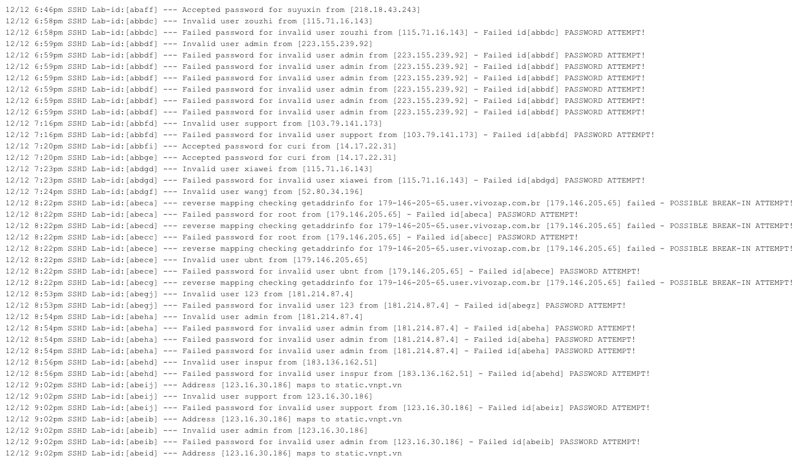
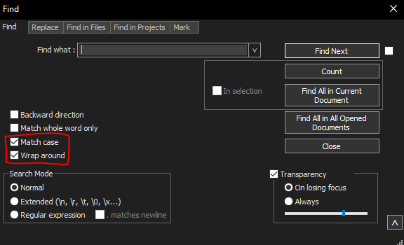
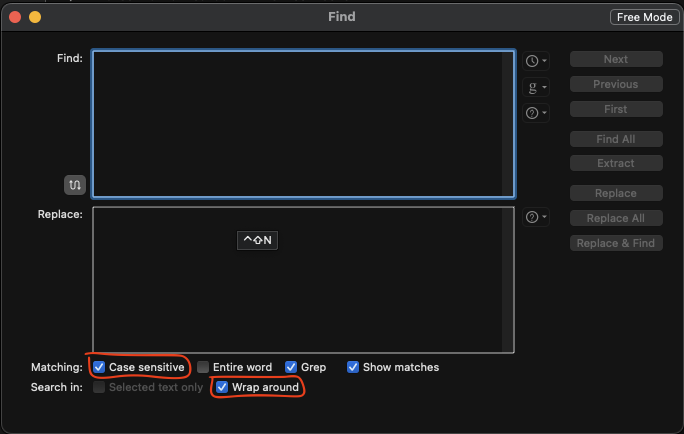
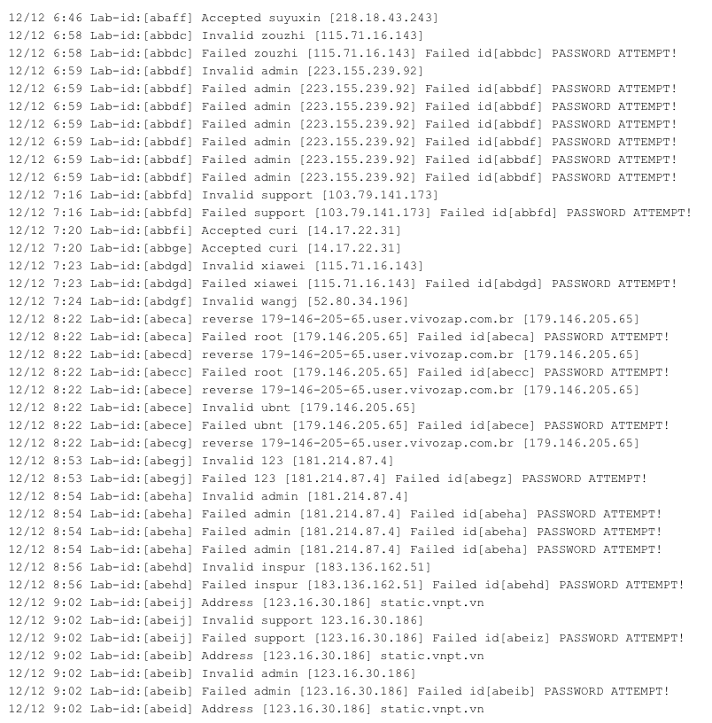
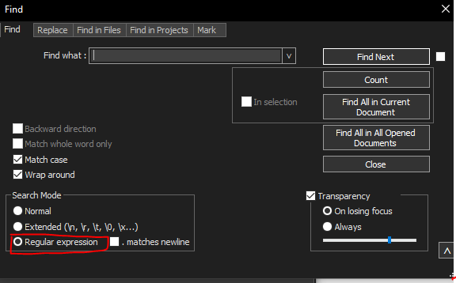
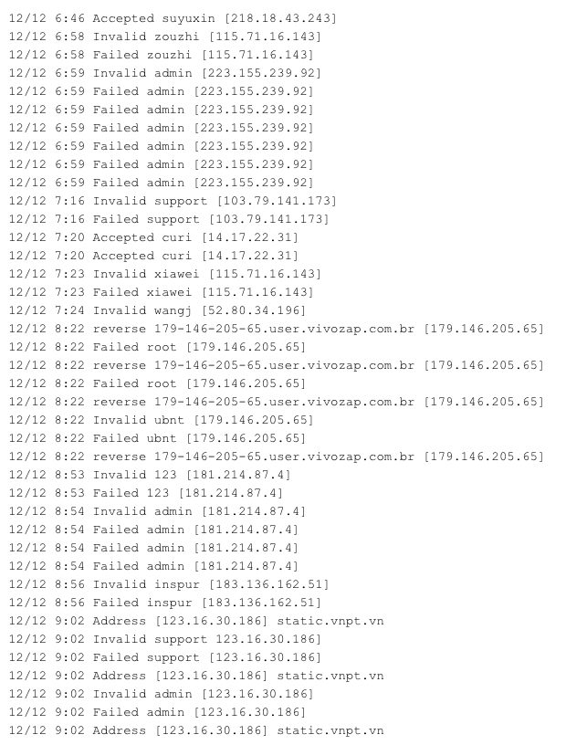

# Log File Parsing Demo
<hr/>

## Introduction

This demo serves to simplify log file cleanup and ease access of relevant log file information.  Through this guide,
parsing the data will be greatly simplified and allow for easier creation of B-Tree keys.  Below is the [original text](demo_data/SSH_Log_Demo.txt) file:


By the end of this process, each line should represent the following format:
```log
<date> <time> <type> <user> <ip>
```

(aside from `<type>` = `Address` then):
```log
<date> <time> <type> <user> <ip>
```

Example:
```log
12/12 6:46 Accepted suyuxin [218.18.43.243]
12/12 6:58 Invalid zouzhi [115.71.16.143]
```

## Step 1: Download Text Editor

In order to parse through [SSH_Log_Demo.txt](demo_data/SSH_Log_Demo.txt), we first need to
download the corresponding Text Editor:

### Windows

- [Notepad++](https://notepad-plus-plus.org/downloads/)

### Linux

- [Notepad++ (using SNAP)](https://snapcraft.io/notepad-plus-plus)

### macOS

- [BBedit](https://www.barebones.com/products/bbedit/)


Note: Notepad for Windows, Vim for Linux, and TextEdit for macOS would prove highly challenging for efficient parsing of the file. 
<hr/>

## Step 2: Text Editor Settings

We then need to adjust some setting within the Text Editor to ease the parsing process.  It is recommended to turn the `Wrap around` and `Match case` on.  See below for example settings:

### NotePad++


### BBEdit


<hr/>

## Step 3: Remove Basic Words
Open [SSH_Log_Demo.txt](demo_data/SSH_Log_Demo.txt) in the Text Editor and remove simple words
using the `replace`.  Be aware of whitespace and case sensitivity of words when removing the
following words:

- `pm`
- `SSHD`
- `---`
- `password` 
- `from` and `for` 
- `invalid user`
- `user`
- `failed - POSSIBLE BREAK-IN ATTEMPT!` 
- `-` 
- `mapping` 
- `maps to` 
- `checking getaddrinfo `

Once the words are removed and the white space is cleaned up, the file should look like the following:



<hr/>

## Step 4: Remove Phrases with RegEx
Note that NotePad++ has a setting for Regular Expression that must be checked.   


(BBEdit automatically does Regular expression when the expression falls under a specific format)

Here is a [helpful link](https://www.linguisticsweb.org/doku.php?id=linguisticsweb:tutorials:basics:regex:regex-notepad) 
for a RegEx cheat sheet that better details each Regular Expression's operations and effects.

Here is a [helpful regex playground](https://regexr.com/)
that provides explanations for your regular expressions.

After [Step 3](#step-3-remove-basic-words), Regular Expressions can be used to remove the phrases of `Lab-id:[axxxx]` 
and everything after and including `Failed id[abbdf]`.  Be aware of whitespace and case sensitivity of words when removing the following phrases
with the below Regular Expressions:
- `Lab-id:[axxxx]` &rarr; `Lab-id:[\[a-j]*] ` where:
  - the `[a-j]` removes a character between `a-j`, 
  - the `*` removes any amount of a certain character (in this case any amount of `[a-j]`'s)

- `Failed id[abbdf]..` &rarr; ` Failed id.*` 
  - where the `*` removes any amount of characters after the desired position

Once the phrases are removed and the white space is cleaned up, the file should look like the following:



<hr/>

## Step 5: Conclusion
The file has now been filtered to the relevant information regarding each activity's `date`, `time`, `type`, `user`, and `ip`.  In 
doing this, the creation of B-Tree keys will be much smoother in obtaining the specific information to a certain type of B-Tree.
